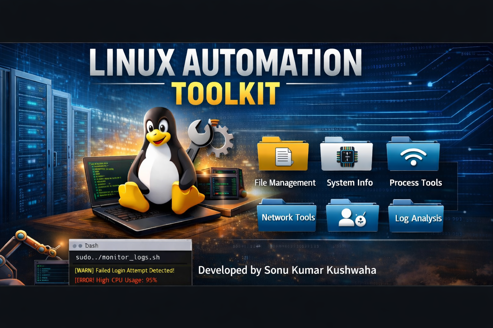

<p align="center">
  
</p>
# 🚀 Linux Automation Toolkit

A modular, menu-driven **Linux Automation CLI Toolkit** built using Bash scripting.
This project automates common system administration tasks such as file management, process monitoring, networking, logging, and user management.

---

# 📌 Features

* 🧭 Menu-driven CLI interface
* 📂 Modular architecture (easy to scale)
* 🔁 Reusable Bash scripts
* ⚡ Automation of repetitive Linux tasks
* 🔐 Security and system-level operations
* 👨‍💻 Beginner-friendly yet powerful

---

# 🧩 Project Structure

```bash id="n1q6fx"
Linux-Automation-Toolkit
│
├── toolkit.sh                # Main entry point
│
├── File_Management
├── Log_Management
├── Network_Management
├── Process_Management
├── System_Information
└── User_Management
```

---

# ⚙️ Modules Overview

## 📂 File Management

* Directory creation & validation
* File creation & existence check
* File permission checks (Read, Write, Execute)

---

## 📜 Log Management

* View system logs
* Monitor live logs
* Detect failed login attempts
* Identify suspicious IP activity

---

## 🌐 Network Management

* Ping & traceroute
* DNS lookup & reverse DNS
* Network scanning
* Open ports detection
* Latency monitoring

---

## ⚙️ Process Management

* List running processes
* Search processes
* Kill processes
* Monitor CPU & memory usage

---

## 💻 System Information

* CPU details
* Memory usage
* Disk usage

---

## 👤 User Management

* Create and delete users
* Check user existence
* List system users
* Detect sudo users
* Detect locked accounts

---

# 🧭 How It Works

```text id="yqg69v"
toolkit.sh
   ↓
Select Module
   ↓
Select Operation
   ↓
Execute Script
```

👉 The toolkit follows a **multi-level menu system** for easy navigation.

---

# ▶️ Getting Started

## 1️⃣ Clone the Repository

```bash id="c3m7hl"
git clone https://github.com/sonukkushwaha0801/Linux-Automation-Toolkit.git
cd Linux-Automation-Toolkit
```

---

## 2️⃣ Make Scripts Executable

```bash id="36y6i3"
chmod +x toolkit.sh
```

---

## 3️⃣ Run the Toolkit

```bash id="zptm3o"
./toolkit.sh
```

👉 For features requiring elevated privileges:

```bash id="zz5xos"
sudo ./toolkit.sh
```

---

# 🔐 Permissions Note

Some modules (User Management, Log Analysis) require **root privileges**
to access sensitive system files like:

* `/etc/shadow`
* system logs

---

# 🔄 Argument vs Interactive Scripts

| Type           | Description                             |
| -------------- | --------------------------------------- |
| Argument-Based | Input passed via command-line arguments |
| Interactive    | User provides input during execution    |

---

# 🎯 Use Cases

* Linux system administration
* Automation of repetitive tasks
* Learning Bash scripting
* Cybersecurity basics (log analysis, user audit)
* DevOps practice projects

---

# 🚀 Future Enhancements

* Add logging system
* Add colored CLI output
* Convert to Python CLI tool
* Add plugin-based architecture
* Create installable package

---

# 📸 Demo 

[▶ Watch Demo](./demo.mp4)

---

# 🤝 Contributing

Contributions are welcome!
Feel free to fork the repository and submit a pull request.

---

# 👨‍💻 Author

**Sonu Kumar Kushwaha**
Linux Automation Toolkit Project

---

# ⭐ Support

If you like this project, give it a ⭐ on GitHub!

